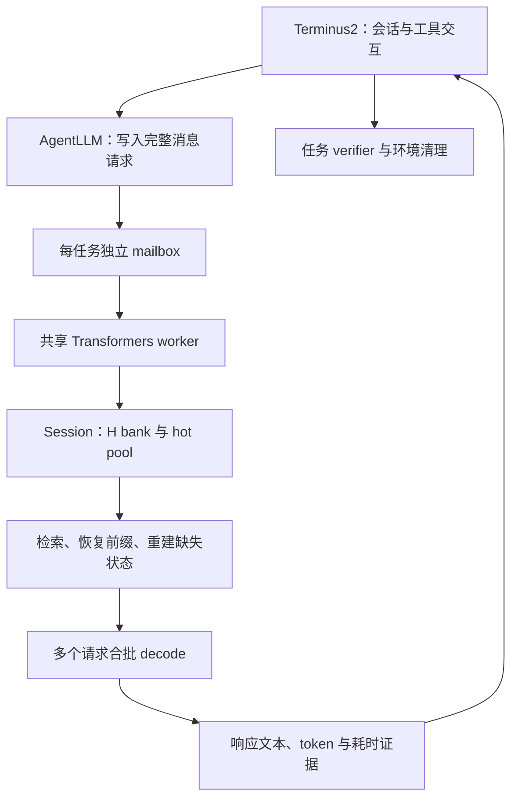

# Encbank Hot Buffer Agent：当前实现说明

版本：2026-09-22。本文描述本轮 **27B、Transformers、真实 Terminal-Bench** 的已实现系统。实验状态引用 2026-09-22 23:07（UTC+8）的已核查快照，不代表阅读本文时的实时状态。

## 1. 解决什么问题

在 agent 场景中，长期历史来自用户消息、模型回答和工具输出。一次模型调用也可能生成远超一个 chunk 的内容。

当前实现把长期历史保存为 chunk 级 H21，按需检索部分 chunk 参与后续推理；再增加 hot buffer，保留近期构建过的上层 KV 和递归状态。检索结果具有相同有序前缀时，复用这些状态，减少重复执行上层网络的成本。

三个组成部分分别负责不同工作：

| 组成部分 | 保存内容 | 作用 |
|---|---|---|
| H bank | 历史 chunk 的 H21 | 长期保留历史表示，供未来检索与重建 |
| 活动缓存 | 本次读取/生成正在使用的 lower、upper KV 与递归状态 | 支持逐 token decode |
| Hot buffer | 某个确定有序前缀下的分段 upper KV，以及前缀结束时的递归状态 | 跳过已完成且仍有效的上层重建 |

Hot buffer 用额外显存换重建时间。它不替代 H bank，也不意味着所有历史 KV 都常驻显存。

## 2. 模型与关键参数

服务器模型目录名称是 Qwen3.8-27B；实际配置为 `Qwen3_5ForConditionalGeneration` / `qwen3_5_text`，因此按其混合注意力结构实现。

| 参数 | 当前值 |
|---|---|
| 总层数 | 64 层：16 层 full attention，48 层 linear attention / Gated DeltaNet |
| 隐藏维度 | 5120 |
| Encbank 切分点 | H21，即经过前 21 个 block 的 hidden |
| lower / upper | 代码索引 `[0:21]` / `[21:64]`；upper 为剩余 43 层 |
| upper 结构 | 11 层 full attention，32 层 linear attention |
| chunk 大小 | 512 tokens |
| 每次检索数量 | 最多 12 个历史 chunk，另加 1-token sink |
| 重检索间隔 | 同一次调用每生成 512 tokens |
| Hot 容量配置 | 每会话 24 个完整 chunk 等价的字节预算，另留 sink 快照空间 |
| 解码调度片段 | 每个 quantum 最多 32 个生成步骤，可提前结束 |
| 数值格式 | backbone / H / KV 为 BF16；原 Encbank 上层 LoRA 为 FP32 |
| 采样 | thinking/xhigh，temperature=1，top_p=0.95，采样 top_k=20 |

这里的 H21 与早先 Qwen3-8B 实验中的 H12 不同。检索 top12、每会话 hot24、任务并发24也是三个不同参数。

## 3. Agent 与模型服务如何连接

使用官方 Harbor / Terminus2 的 agent 工作流，将模型调用接口替换为共享文件系统上的请求/响应通道。工具执行和 verifier 保留在任务环境中；训练、推理及模型文件均在服务器。



每个实验组只有一个共享模型 worker，每个任务拥有独立 Session。不同任务不共享 H、hot entries 或递归状态；同一任务跨多次模型调用保留 Session，任务结束后释放。

请求包含完整消息历史、任务身份、调用序号和请求身份。响应绑定请求 SHA；接口拒绝重复请求，并检查会话历史连续性。worker 失败或提前退出会使等待请求显式失败，不伪装成正常模型回答。

随机种子由实验 seed、任务名和调用序号确定，每个请求使用独立随机数生成器。它避免请求之间共用采样 RNG，但不保证不同算法或不同浮点执行路径生成完全相同的轨迹。

## 4. 第一次读取与跨调用复用

### 4.1 分块与 H 身份

消息经 chat template 转成 token ids。首 token 单独作为 sink，其余按 512 tokens 划分；每次 prefill 保留长度为 1～512 的尾部作为当前活动输入。

对长度为 `L` 的输入，归档 chunk 数是 `floor((L-2)/512)`。这个写法保证有非空尾部；当尾部恰好长 512 时，会在读取后立即执行在线归档。

H bank 的索引为：

```text
chunk_key = (chunk_index, SHA256(token_ids))
H_identity = (chunk_key, session_local_serial)
bank[chunk_key] = (H21, H_identity, origin)
```

`origin` 区分独立写入的历史 H 与在线生成时保留的 H。序号在本 Session 内区分 H 版本。每次 prefill 清除不再属于当前历史分块的 H 身份，避免错误复用被重分词或改写的块。

已有 H 直接复用；缺失的历史块通过 lower 层独立计算 H21。这里“只重建选中 chunk”指 **upper 重建**：首次接入一段尚未写入的历史，仍需先为其中缺失的归档块执行 lower 写入。

### 4.2 当前真正启用的检索

当前 hot runtime 使用 **token-id BM25 多跳检索**，并非 hidden 向量检索：

1. 初始查询取本次调用初始输入的前 2048 tokens，加当前完整序列的后 2048 tokens。
2. 每跳最多选 4 个正匹配 chunk；下一跳使用刚选中的 chunk 内容查询。
3. top12 对应自动最多 3 跳；无正匹配时提前停止。
4. 未达到 `min(历史块数, 12)` 时，用最近的未选 chunk 补足。
5. 最终按历史时间顺序排列，前面加入 sink。

代码库另有 hidden mean-pool / cosine 等检索器，但本轮冻结运行路径没有启用它们。H 是历史存储表示，不代表当前检索评分也在 H 上进行。

### 4.3 上层读取

先恢复 hot pool 中可用的连续有序前缀，再将其余选中 chunk 的 H21 依次送入 upper。每完成一个段，将该段 upper KV 与此时的前缀递归状态放入 hot pool。

随后计算当前尾部的 lower H21，并继续送入同一 upper 活动缓存。upper 的 full attention 在选中的历史和当前输入之间使用统一的因果 attention；并非对每个 chunk 各算一次互不相关的 attention 后相加。

upper 位置编号按选中片段压紧排列。lower 独立历史写入的位置从本块起始计算；在线 lower 则在当前刷新窗口内连续增长。

## 5. Hot buffer 的内容与命中条件

### 5.1 一个 entry 保存什么

`PrefixPool` 使用带访问顺序的字典管理 entries。对于选中的前缀 `[sink, A, B]`，存储结构可概括为：

```text
key = (H_identity(sink), H_identity(A), H_identity(B))
value = {
    本段 B 在各 upper full-attention 层的 K/V,
    处理完 sink、A、B 后，各 upper linear 层的 recurrent/conv 状态,
    本段长度、实际字节数、来源
}
```

KV 只存本段；递归状态覆盖整个前缀。entry 持有 clone 后的独立张量，不依赖仍在变化的活动缓存。

### 5.2 为什么必须匹配整个前缀

混合架构中的递归状态依赖此前读过的全部内容和顺序。上层深层 KV 也受到此前上下文影响，因此同一个 chunk 在不同前缀下通常不是同一个可复用状态。

例如：

```text
上次：sink → A → B → C
本次：sink → A → D → C
可复用：sink、A
需重建：D、C
```

本次 C 虽然曾经出现，也不能直接使用 `[sink,A,B,C]` 下的旧状态。

恢复过程从 sink 开始逐项匹配，到第一个缺失项立即停止。恢复命中段的 KV 时按序拼接；递归状态仅取最后一个命中前缀的快照。**不能拼接或相加多个独立 chunk 的递归状态。**

当前恢复函数不在同一次 restore 中跳过缺失项、再接回后面的 entry。如果 sink 或中间段被淘汰，即使后面的完整键还在池里，本次也只恢复第一个缺失项之前的连续部分。这限制了有效命中率。

### 5.3 淘汰策略

每个 Session 的预算为：

```text
budget = hot_chunks × 120.5 MiB + 99 MiB
```

插入时按真实存储字节统计，超预算则从最久未访问的 entry 开始淘汰。读取会更新访问顺序，因此是 LRU，不是单纯按创建时间 FIFO。24 是完整块等价容量；池中可以包含同一 chunk 在不同前缀下的多个版本。

worker 另有全局淘汰：在接纳新请求时，若 allocated 超过 200 GiB，按 Session 最近使用时间和各池 LRU 淘汰 hot entries。H bank 保留，可在之后重建。

这个全局检查不是每个 decode 步骤都执行，而且主要看 allocated，不覆盖 reserved 碎片风险。故当前准入和淘汰机制不能保证长时间运行不 OOM。

## 6. 新生成的 chunk 如何进入缓存

decode 时，每个新 token 都通过 lower 得到实际 H21，再通过 upper。对应 H21 被累计到当前 chunk。

当当前 chunk 满 512 tokens：

1. 立即把这 512 个实际 H21 归档到 H bank。
2. 将该块身份加入当前上层有序前缀。
3. 检查 H bank 中已有值是否与当前实际 H 一致，以及此前在线前缀是否仍有效。
4. 一致时，立刻保存该块 upper KV 和结束瞬间的递归状态，来源记为 `online`。

这实现了“刚生成的 chunk 也主动进入 hot buffer”。以后检索到它且前缀一致时，可以避免首次上层重建。不过，主动入池不等于下一次一定能命中。

Cold 和 Hot 两组均保存在线 H；Hot 额外保存上述状态快照。若相同 token 身份已有不同定义的 H，代码保留既有 H，并拒绝把不一致的在线快照登记在该身份下。

### 6.1 归档边界与重检索边界并不相同

两种事件目前分别触发：

- **归档：** 当前 chunk 累计到 512 tokens。
- **刷新：** 本次调用累计生成 512、1024、1536……tokens，且请求尚未结束。

例如调用开始时已有 100-token 尾部：生成 412 tokens 后就归档第一块，但到生成第 512 个 token 时才重新检索；此时还有新的 100-token 尾部。

归档操作本身不会立即清空 lower cache。lower 在一次刷新窗口内保留连续上下文；在线 H 因而不必与“每块独立 lower forward”的 H 相同。当前实现不能描述为“每个绝对 chunk 边界都重置 lower”。

刷新时丢弃旧活动 lower/upper 引用，重新分块、复用 H、检索、恢复 hot 前缀、重建剩余段，再继续 decode。512 是刷新周期，不是输出上限。

按默认 top12，刷新后历史 upper 长度最多 `1+12×512=6145`。加当前尾部及下一轮最多 512 个生成位置，刷新前 upper 的逻辑长度最多约 7169，lower 最多约 1024；这不包括独立 hot pool、历史 H、padding 或临时副本的占用。

## 7. 多任务如何合批

任务控制器的 `task_concurrency` 决定同时推进多少个 Trial；worker 的 `decode_batch_size` 决定同时接纳多少个模型请求。工具执行期间任务仍存活，但未必在 GPU 上生成。

worker 按请求到达顺序接纳，每个 Session 同时最多一个活动请求。prefill 和检索刷新目前按请求依次进行；decode 才进行跨请求合批。

每个 quantum：

1. 对各行不同长度的 full-attention KV 左侧补齐，再拼成 batch；递归状态按 batch 维拼接。
2. 每行保持自己的真实位置和 padding mask，递归模型不消费 padding token。
3. 最多推进 32 步；任一行结束、取消或需要刷新时可提前返回。
4. 将每行缓存拆回 Session/Request，处理完成或刷新，再接纳新请求。

单 token 的线性投影和归一化固定计算行数为 32，额外行立即丢弃。QKV、MLP、DeltaNet 合批；full attention 的 SDPA reduction 按真实行长分别执行，以控制批次形状引入的数值差异。

因此这是 **基于 Transformers 的自定义调度实现**，既不是 stock `generate()`，也不是 vLLM/PagedAttention。达到24个任务或24个 Session不等于每一时刻都有24路 decode；实际并行以 `batch_steps` 和实时活动记录为准。

## 8. 显存账与当前瓶颈

下列为当前模型配置的字节推导，MiB/GiB 均为二进制单位。

| 项目 | 大小 |
|---|---:|
| 每个历史 token 的 H21 | 10 KiB |
| 一个 512-token chunk 的 H21 | 5 MiB |
| 一个 chunk 的 upper full-attention KV | 22 MiB |
| 一个 upper 前缀的 linear/conv 状态快照 | 98.5 MiB |
| 一个完整 hot entry | 120.5 MiB |
| 每会话 hot24 加 sink 预算 | 约 2.92 GiB |
| 每会话全部活动 linear/conv 状态 | 147.75 MiB |
| Dense 全部 full-attention KV，每 token | 64 KiB |

总占用还包括共享模型、所有历史 H、活动 KV、hot pool、合批 padding、临时副本与分配器保留空间。H 与 hot 状态同时存在，不应重复扣除 H。H bank 随历史增长；有界活动 KV 不意味着无限历史免费。

当前 `merge_caches` 对每层执行 `pad` 和 `cat`，临时补齐张量、旧缓存、新缓存可能同时存在。decode 期间 DynamicCache 的扩展也有分配成本；拆回各行时使用 view，可使旧 batch 的底层存储继续存活。内存统计按底层 storage 去重，但去重计数不会消除真实占用。

在已观察的 OOM 中，reserved 显著高于 allocated。reserved 是分配器管理的总空间，其中未被活跃张量使用的部分仍可能受碎片或分配生命周期限制；不能视作可以立即满足任意新张量的整块空闲内存。没有当时完整 allocator snapshot，尚不能精确分解全部原因。

改进方向包括减少反复 pad/cat、复用容量缓冲区、调整缓存布局与分配器配置；这些尚未作为已验证修复写入本轮冻结运行代码。

## 9. 对照组与现有证据

| 组别 | 任务/解码并发上限 | 每会话 hot 配置 | 区别 |
|---|---:|---:|---|
| Dense8 | 8 | 0 | 全历史 Dense，允许有效完整前缀跨调用复用，无 Encbank LoRA |
| Cold8 | 8 | 0 | 流式 H21、周期检索、在线 H 归档，每次重建选中 upper 历史 |
| Hot8 | 8 | 24 | Cold 基础上加有序前缀 hot 复用 |
| Hot32 | 32 | 24 | 更高并发，已因 OOM 退出 |
| Hot24 | 24 | 24 | 用户要求的独立新组，仅相对 Hot32 降低两个并行上限 |

Cold 是本轮流式对照，不是未经修改的旧 Encbank。Dense/Encbank 还有 adapter 和历史读取方式差异；比较 Hot/Cold 更适合隔离缓存复用的收益。

### 9.1 已通过的数值与短时资格

- 重复前缀 hot 与 cold 的测试 KL=0；改变前缀时，缓存正确失效。
- 两路不同长度/顺序的限定 batch 测试，最终候选 KL=0。
- 1056 个强制 trace tokens 跨两次重检索，边界 KL 约 0.00000350 / 0.00022759；命中包含在线归档块。
- Dense 分段 prefill 对 stock Transformers 的测试 KL 约 0.001774。
- 合成容量中 Hot 的 128K×32路、256K×24路通过短时实际分配与两步 decode；后续 Hot32 真实运行 OOM，说明该资格不能证明动态长期稳定。

这些是具体输入与执行窗口下的资格结果，不是所有输入上逐 bit 一致的证明，也不是正式 agent 加速率。

### 9.2 固定时间的真实 Terminal-Bench 快照

各组为相同32题、独立任务环境。以下只引用 **2026-09-22 23:07 UTC+8** 快照：

| 组别 / 作业 | 有 verifier 的题数 | 通过 / 未通过 | 当时状态 |
|---|---:|---:|---|
| Dense8 / 119997 | 19/32 | 14 / 5 | OOM 退出，另13题异常中断 |
| Cold8 / 120044 | 2/32 | 1 / 1 | 运行中 |
| Hot8 / 119999 | 3/32 | 2 / 1 | 运行中 |
| Hot32 / 120000 | 1/32 | 1 / 0 | OOM 退出，另31题异常中断 |
| Hot24 / 121413 | 7/32 | 5 / 2 | 运行中，实时24路生成 |

Hot24 当时完成552次模型回复，allocated约145.44 GiB、峰值allocated约152.95 GiB、reserved约242.63 GiB，尚无 worker failure，但接近248 GiB进程限额。

Dense8 OOM 发生在合批 KV 申请3.34 GiB时，当时 allocated约139.01 GiB，reserved但未allocated约105.76 GiB。实际父进程 wait=1，32份环境关闭收据齐全。Hot32同样保留失败证据。基础设施中断不混入模型答错数，Hot32与Hot24不合并计分。

尚无完整、同任务配对的最终成功率和端到端加速结论。完成题数不同不能直接除成加速比；各组启动时间和任务轨迹也不同。

## 10. 运行证据与统计口径

| 文件/字段 | 用途 |
|---|---|
| `plan.json`、`source_manifest.json` | 冻结配置与源码身份 |
| `mailbox/<task>/*.request.json` / `*.response.json` | 调用输入、回复及请求 SHA |
| response `events` | 每次检索的选择、命中、重建和在线命中 |
| response `times` | write、检索、prefill、归档、decode cohort 等耗时 |
| response `hot_stats` | 插入、LRU淘汰和全局淘汰计数 |
| `worker/status.json` | 运行中的活动数、batch 分布及显存 |
| `worker/failure.json`、`model_parent_exit.json` | 失败原因与实际父进程 wait |
| `results/*/execution_receipt.json` | verifier、异常、耗时与环境关闭证据 |
| `jobs/run_complete.json` | 控制器各任务退出汇总 |

注意：

- `completed` / response 数是模型调用数，不是完成题数。
- 请求记录中的 `decode_cohort_seconds` 是共享批次耗时，会出现在多行请求中，不能逐请求相加当作 GPU 总时间。
- 峰值显存是共享 worker 的累计峰值，不是单请求独占显存。
- hot 的 `cached_prefix_tokens` 是基于初次命中 chunk 数的近似使用量字段，不等于所有刷新期间节省的 forward tokens；分析应读每次 `events`。
- worker退出后，旧 `status.json` 中的 active 不再代表仍在运行；以失败、父进程和调度器状态为准。
- 无人为生成长度或任务/请求时限，不等于没有原生上下文、物理显存和任务环境边界。

## 11. 文件入口与实现边界

本地源码目录：`/srv/encbank/workspace/experiments/tf27b_hot_terminal_20260921/`。

服务器开发目录：`/srv/encbank/qencbank_align_codex_20260911/tf27b_hot_terminal_20260921/`。

服务器冻结运行目录：`/srv/encbank/qencbank_align_codex_20260911/tf27b_hot_live_20260921/`；各组独立子目录，canonical 作业身份保存在 `submissions.json`。开发目录不等于活跃源码目录；不可热改现有实验或重复提交。

| 源文件 | 职责 |
|---|---|
| `tb_agent.py` | Terminus2 模型接口、mailbox、历史连续性与响应校验 |
| `worker.py` | 共享模型、请求准入、Session 生命周期、调度、指标 |
| `hybrid_hot.py` | H bank、PrefixPool、prefill、promotion、刷新、decode quantum |
| `batch_cache.py` | 变长缓存合批、真实位置及 padding 处理 |
| `model_setup.py` | 模型与 adapter 加载、GPU准入、数值稳定设置 |
| `memory_selectors.py` | BM25 与其他备选检索器 |
| `parallel_trials.py`、`controller.py` | 正式任务并发、任务环境、父进程及释放记录 |
| `observe.py` | 只读状态与证据汇总 |

相关本地文档：

- [运行记录](/srv/encbank/workspace/experiments/tf27b_hot_terminal_20260921/CURRENT_RUN.md)
- [实验协议](/srv/encbank/workspace/experiments/tf27b_hot_terminal_20260921/PROTOCOL_zh.md)
- [数值和容量资格](/srv/encbank/workspace/experiments/tf27b_hot_terminal_20260921/QUALIFICATION_RESULTS_zh.md)
- [27B基础字节账与历史容量估算](/srv/encbank/workspace/experiments/hot_buffer_20260921/MEMORY_27B_zh.md)：早期容量规划，运行状态和实现进展以上述较新记录为准。

尚未接入本实现的研究想法包括：每块摘要向量、summary/full 动态选择、多深度 hidden anchors、从单层 hidden 直接预测所有上层 KV，以及分页KV后端。摘要方案目前只有[独立设计](/srv/encbank/workspace/experiments/chunk_summary_20260922/DESIGN_zh.md)，没有摘要训练或质量结果；这些不能算入已实现 hot buffer 的性能收益。
